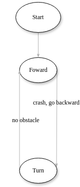
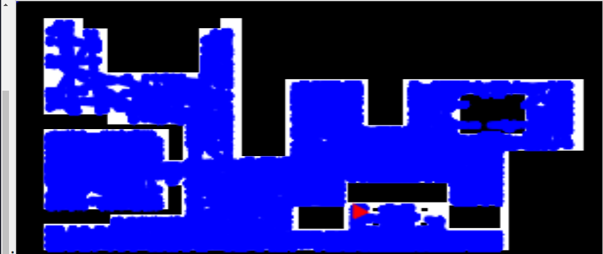

# P1 - Vacuum Cleaner
## Concept

The first solution was approached trying to simplify as much as possible, meaning that only the bumper was used to create a vacuum cleaner that tackles the task simply. Therefore the first idea is to create a vacuum cleaner that approaches the cleaning task in the following way, first it goes forward and when it hits something it goes backwards to give room for maneuver and then turns 90 degrees. This way we almost go from wall to wall and guarantee good coverage of the space and fewer collisions in the same place.

## Algorithm

The vacuum cleaner starts in the "Foward" state going foward, and remains in the foward state until the bumper detects a collision. Next when obstacle is detected the vacuum cleaner goes back so that it can turn smoothly, there for the robot goes backwards then it changes state.The next state is "Turn" in which the vacuum cleaner turns almost 90 degrees , this optimises the space that is being coverd add garanties les repetetive collisions.

## State diagram
State diagram:

## Exploration
Vacuum cleaner exploration's image after 1 hour when it finisht cleaning:

Video while cleaning:

https://github.com/user-attachments/assets/4261540d-1a08-4300-a3ac-c6ccecd256fd

Video towards the end of the cleaning:

https://github.com/user-attachments/assets/e856d3bf-f333-455b-998b-15143ef6f092

The rest of the videos:

[video1.webm](https://github.com/user-attachments/assets/24d4e3ea-bb26-4a14-8149-586d9564e9c6)
[video2.webm](https://github.com/user-attachments/assets/2b77027c-3cca-466f-aead-d7980b76b3ac)
[video3.webm](https://github.com/user-attachments/assets/7f717393-ec3d-4a8e-a974-10d246531542)
[video4.webm](https://github.com/user-attachments/assets/e456b175-c688-4b2d-bd58-831281695530)
[video5.webm](https://github.com/user-attachments/assets/a2411927-4686-42ed-bb83-48511758750b)

## Difficulties

The first difficulty was that I also wanted to add the laser to be able to detect the objects before the collision, but when the laser was empty there were difficulties in continuing with the other states, that's why I decided to simplify it. Since the idea could be recreated with the bumper, it was approached like that. But when trying to create it with the bumper, there were difficulties with the "Backward" state because when entering it and then going to the "Turn" state it was already detected that there was no obstacle, that's why only 2 states were made and the starting part back was added to when the crash was detected. Later there were complications with the vacuum cleaner getting stuck in the same place, but this could be solved by increasing its angular speed and thus making it rotate more widely (90 degrees).
